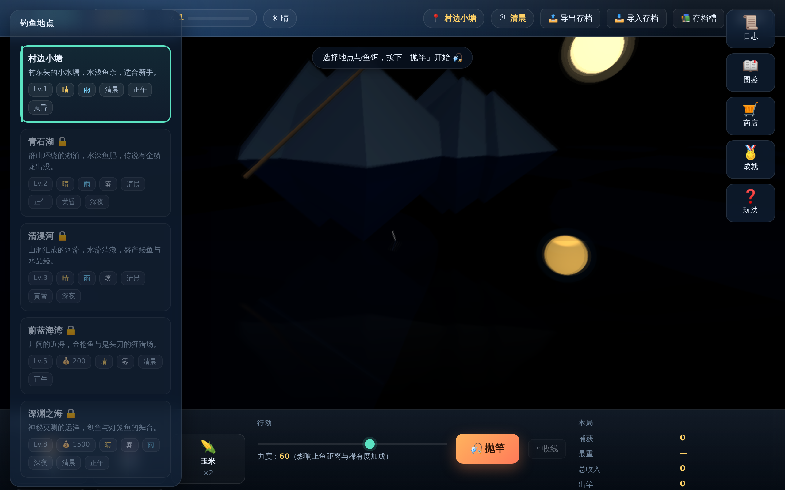
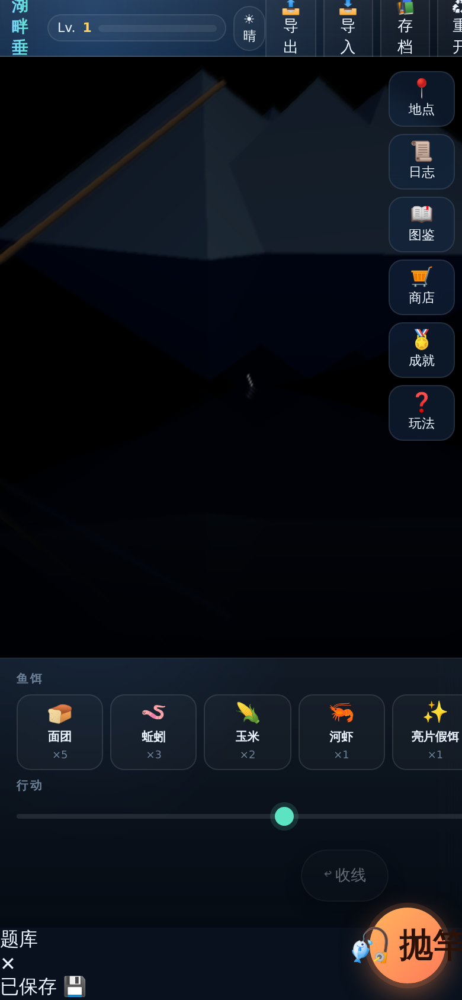
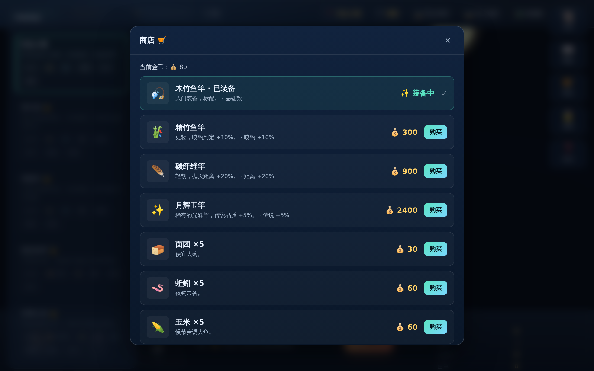
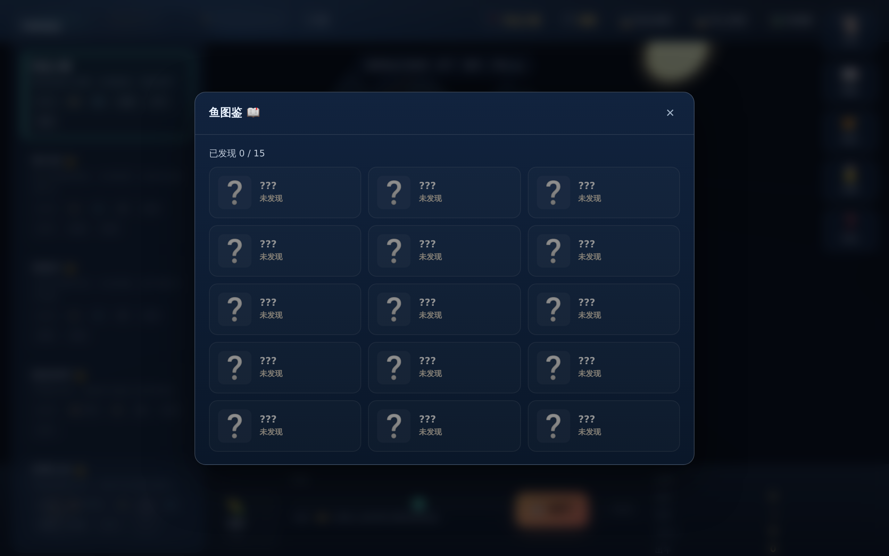
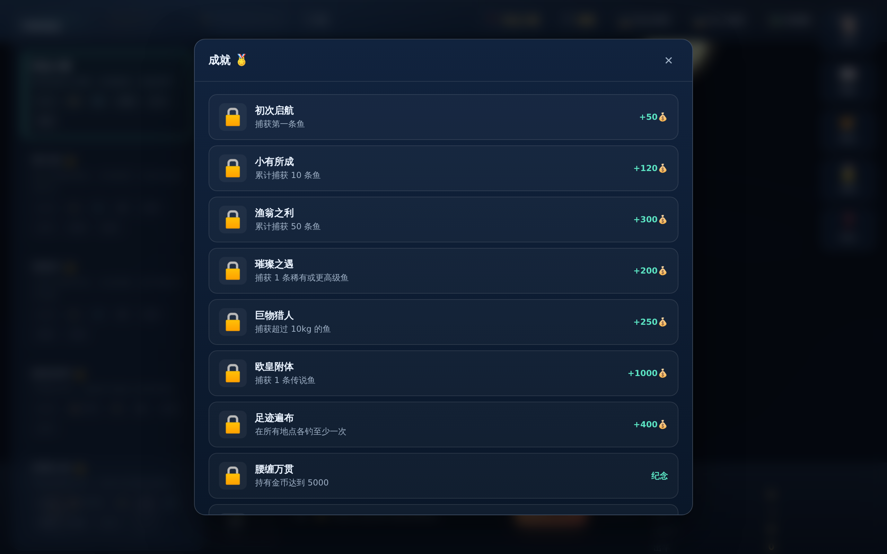
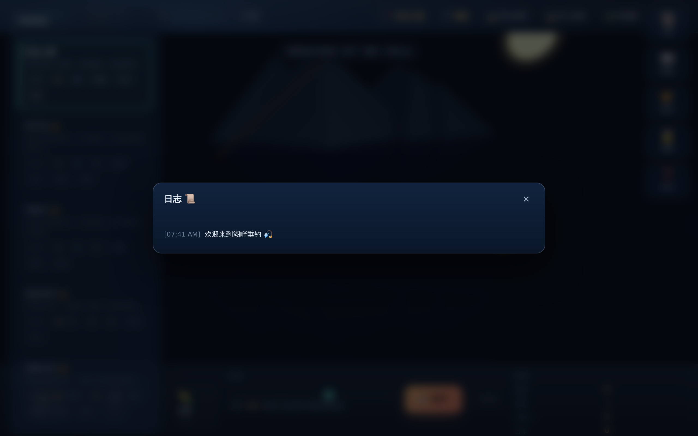
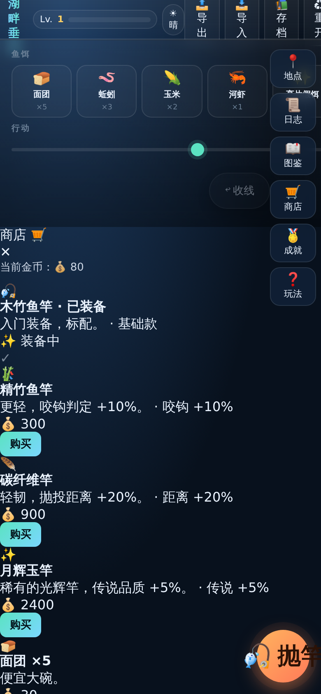
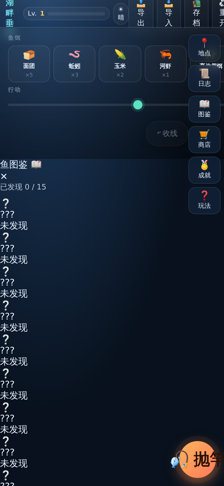

# 🎣 湖畔垂钓 · Lake Fishing

> 一个 3D 网页钓鱼游戏：选饵抛竿、等鱼试探、收线小游戏、捕获奖励——全程 Three.js 3D 反馈（波纹水面、镜面倒影、自实现 SSR、镜头跟拍、WebAudio 合成 BGM）。

| 🖥️ 桌面浏览器 | 📱 移动触屏 |
| :---: | :---: |
|  |  |
| [`web/`](./web) | [`mobile/`](./mobile) |

## 📸 预览

| 主界面 | 商店 | 图鉴 | 成就 |
| :---: | :---: | :---: | :---: |
|  |  |  |  |
| 日志 | 手机-主界面 | 手机-商店 | 手机-图鉴 |
|  |  |  |  |

## ✨ 特性一览

### 游戏内容
- **5 个钓鱼地点**：村边小塘 → 静谧山湖 → 急流山涧 → 深海钓场 → 深渊之海，各有天气 / 时段 / 鱼种 / 解锁条件
- **15 种鱼、6 档稀有度**：常见 / 少见 / 稀有 / 史诗 / 神秘 / 传说（每种鱼有体型区间、鱼饵偏好、天气时段偏好）
- **5 种鱼饵**：面团 / 蚯蚓 / 玉米 / 河虾 / 亮片假饵（在商店购买和消耗）
- **4 款鱼竿**：基础 / 精竹 / 碳纤维 / 月辉玉（咬钩 / 抛距 / 传说几率不同 buff）
- **收线小游戏**：按空格或点击「锁定」冻结指针，停在绿色区间完美收线，偏离越远越容易断线跑鱼
- **10 项成就**：捕获次数 / 总收入 / 传说 / 最大体重 / 全鱼种 / 全地点 / 完美收线 / 0 逃跑 / ...
- **天气 + 时段**：随机缓慢轮换（4% 概率 / 6 秒），影响鱼种刷新

### 3D 视觉（Three.js r158）
- **波纹水面**（FFT 噪声 + GPU 着色器）
- **镜面倒影**（Reflector）
- **屏幕空间反射**（SSR）
- **景深模糊**（DoF）
- **天气粒子**（晴 / 雨 / 雾 / 雪，GPU 实例化）
- **鱼跃水面 cinematic**（抛物线 + 镜头震 + target 跟随）

### 体验
- **音效全程序化**（WebAudio 合成海浪 BGM + 风铃 + 抛竿 / 收线 / 捕获 / UI 咔哒，零外部音频）
- **OrbitControls**（桌面鼠标拖 / 触屏 pinch 缩放）
- **新手引导**：4 步轻量 onboard 模态
- **持久化**：localStorage 自动存档 + 校验修复
- **离线存档码**（LK1 编码）：导出 / 导入跨设备
- **多存档槽**：本地命名管理多个进度
- **设计系统**：CSS variables（色板 / 间距 / 字号 / 圆角 / 阴影）

### mobile 专属
- **PWA**：可"添加到主屏幕"，全屏沉浸
- **Service Worker 离线**：v5 预缓存 shared + vendor
- **触屏过激行为禁用**：阻止双指缩放、拖拽选择、长按菜单
- **抛杆按钮 FAB 化**：圆形浮动主操作
- **抽屉式地点选择**：5 个地点横滑切换

## 🚀 快速预览

```bash
# web 版（任意桌面浏览器）
cd web && python3 -m http.server 8000
# 浏览器打开 http://localhost:8000

# mobile 版（同局域网内用手机访问）
cd mobile && python3 -m http.server 8001
# 手机访问 http://<你的电脑IP>:8001
```

> ⚠️ `<script type="module">` 强制 CORS，必须走 `http://` 协议，不能直接双击 `index.html`。
>
> 改完 [`shared/`](./shared) 下的文件，记得执行 `./scripts/sync-shared.sh` 同步到 `web/src` 与 `mobile/src`。

## 🗂 仓库结构

```
fish/
├── .github/workflows/
│   ├── pages.yml             # 部署到 GitHub Pages
│   └── lint-sync.yml         # CI：sync 一致性 + 语法
├── screenshots/              # 8 张截图（web 5 + mobile 3）
├── scripts/
│   └── sync-shared.sh        # shared/ → web/src + mobile/src 同步
├── shared/                   # 跨 web/mobile 复用模块（9 个）
│   ├── state.js              # state + load/save/reset + validate
│   ├── util.js               # $ / el / clamp / toast / ...
│   ├── data.js               # FISH/BAITS/PLACES/SHOP/ACHIEVEMENTS 常量
│   ├── audio.js              # WebAudio BGM + 音效
│   ├── game.js               # cast/tryBite/reel/captureFish/...
│   ├── scene.js              # Three.js 3D 场景
│   ├── savecode.js           # LK1 编码 / CRC32 / deflate-raw
│   ├── slots.js              # 多存档槽管理
│   └── validate.js           # 字段白名单 / 类型 / 范围校验
├── web/                      # 桌面 / 浏览器版
│   ├── index.html
│   ├── README.md
│   ├── LICENSE
│   └── src/                  # 11 个文件：9 shared 副本 + main/ui 专属
└── mobile/                   # 触屏 / 移动版（PWA）
    ├── index.html
    ├── manifest.webmanifest
    ├── icon.svg
    ├── sw.js                 # Service Worker (v5)
    ├── README.md
    ├── LICENSE
    └── src/                  # 11 个文件：9 shared 副本 + main/ui 专属
```

## 🛠 技术栈

- **Three.js r158** + OrbitControls + Reflector（vendor 本地化）
- **WebAudio API**（程序化合成所有声音，零外部音频文件）
- **ES Modules + importmap**（无构建步骤，直接源码运行）
- **Service Worker**（仅 mobile，PWA 离线）
- **CSS variables**（设计系统）
- **localStorage**（持久化 + 校验修复）
- **Pako**（deflate-raw 压缩存档码）
- **零 npm 依赖**（vendor 本地化，GitHub Pages 100% 离线运行）

## 🔄 开发工作流

```bash
# 改 shared/ 后必须同步：
bash scripts/sync-shared.sh

# 改 web/src/ 或 mobile/src/ 端点专属文件不需要 sync

# 本地预览：
cd web && python3 -m http.server 8000
cd mobile && python3 -m http.server 8001

# 提交时 CI 会自动跑：
#   1. sync-shared.sh 是否 no-op（防止 shared/web/mobile 漂移）
#   2. 所有 JS 语法检查
#   3. 静态资源 HTTP 可达性
```

## 🛡 数据校验

所有持久化数据（localStorage、savecode、slots）都经过 [`shared/validate.js`](./shared/validate.js) 校验：
- **类型**：money 必须是 number
- **范围**：level ∈ [1, 99]、money ∈ [0, ∞)
- **白名单**：未知字段被剥离
- **枚举**：placeId / weather / time / equip / _bait 必须合法
- **错误信息收集**：弹 toast 提示

## 🔄 离线存档

游戏支持两种离线存档方式：

| 方式 | 用途 |
|---|---|
| **存档码（LK1）** | 跨设备分享 / 备份。把当前进度编码成短字符串（CRC32 + base64 + deflate），粘贴回去即可恢复 |
| **多存档槽** | 本地保存多个命名存档（实验档 / 主档 / ...），互不干扰 |

## 📜 License

MIT — 见各子目录 `LICENSE` 文件。
